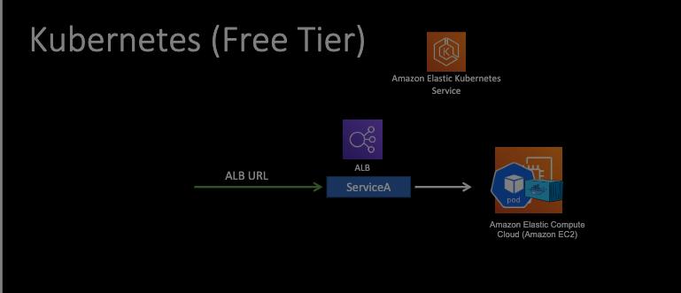
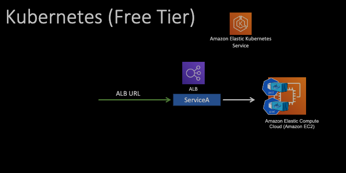
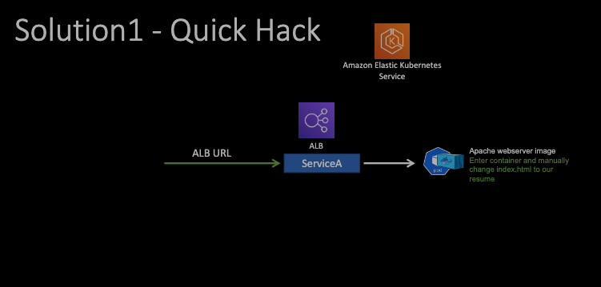

# learn_aws
learning aws through projects

## AWS commands to set up in local
- brew install awscli
- aws configure
    - get the access key and secret from security credentials in aws website.

## s3 buckets
- aws s3 ls
- creating bucket
    - aws s3 mb s3://ashok-firstbucket-cli --region us-east-1
- syncing current directory files to aws bucket online
    - aws s3 sync . s3://ashok-firstbucket-cli
- syncing aws online to current directory (copy all files from s3 bucket to local current direc)
    - aws s3 synch s3://ashok-firstbucket-cli .
- Copy file
    - aws s3 cp ./Satya_D_Resume.pdf s3://ashok-firstbucket-cli

## Resume from Kubernetes
- Page 424 in book.
- Architecture
    - I will run Kubernetes cluster in Aws' kubernetes service - Amazon Elastic Kubernetes Service (EKS).
    - As a worker node, I can run Amazon ec2s. I run my resume container inside a pod in this EC2.
    - I will then expose that resume container using a service which will translate to an Application load balancer.
    - This LB will give a public url with which any one would be able to access the resume running on a container. 
    - 
    - We can have two pods running two resume containers simultaneously to handle load and to scale and highly available down the line.
    - 
    - EKS is billed at $0.10/hr so consider it properly when building and disposing the application.
- Solution 1
    - Grab the standard apache webserver image from Docker hub and then I log in to the container and will manually change the indexed HTML to my resume. It is easy to implement.
    - Problem is, if this pod goes down or the ports needs to scale up, they will scale up using the standard web server image. Now, I have to again login to each container, change the indexed HTML again in multiple containers. This solution is not very sustainable.
    - 
- Solution 2
    - Real world solution.
    - Instead of runnin Apache web server standard container's image, I build a custom image with Apach webserver and the resume built in.
    - In this case, if a pod goes down, I can simply grab this custom container image from Docker hub and will run this as is. 
    - No logging in manually and changing stuff needed with this solution.
    - 
