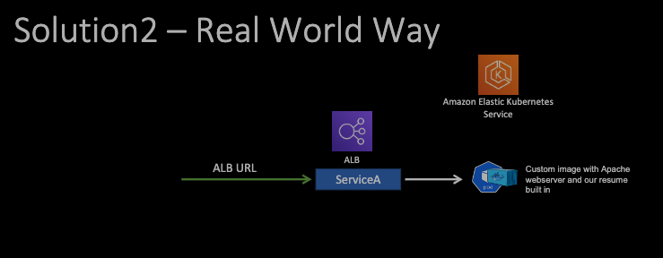

## Resume from Kubernetes
- Page 424 in book.
- https://github.com/saha-rajdeep/awscourseforbeginners/blob/main/resumefromkubernetes

### Architecture
- I will run Kubernetes cluster in Aws' kubernetes service - Amazon Elastic Kubernetes Service (EKS).
- As a worker node, I can run Amazon ec2s. I run my resume container inside a pod in this EC2.
- I will then expose that resume container using a service which will translate to an Application load balancer.
- This LB will give a public url with which any one would be able to access the resume running on a container. 
- 
- We can have two pods running two resume containers simultaneously to handle load and to scale and highly available down the line.
- 
- EKS is billed at $0.10/hr so consider it properly when building and disposing the application.

### Solutions
- Solution 1
    - Grab the standard apache webserver image from Docker hub and then I log in to the container and will manually change the indexed HTML to my resume. It is easy to implement.
    - Problem is, if this pod goes down or the ports needs to scale up, they will scale up using the standard web server image. Now, I have to again login to each container, change the indexed HTML again in multiple containers. This solution is not very sustainable.
    - 
- Solution 2
    - Real world solution.
    - Instead of runnin Apache web server standard container's image, I build a custom image with Apach webserver and the resume built in.
    - In this case, if a pod goes down, I can simply grab this custom container image from Docker hub and will run this as is. 
    - No logging in manually and changing stuff needed with this solution.
    - 

### Containeraizing app workflow
- page 430
- 
- 
- 

- loadbalancerservice.yaml file
    - service is a way to expose pod to the external world.
        - there are 3 different kinds of service:
            - load balancer (linked to the app specified in selector section)
            - 
            - 
    - another kind is "Deployment" also present in the yaml file. httpd apache web server image with two replicas will be taken from the DockerHub.